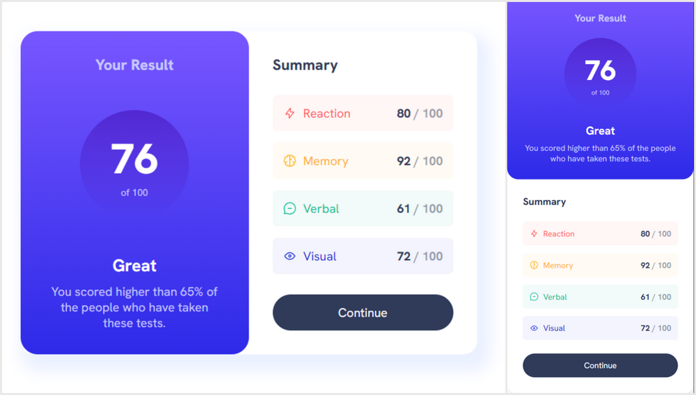

# Result Summary Component

Challenge from [Frontend Mentor](https://www.frontendmentor.io/challenges/results-summary-component-CE_K6s0maV) built using CSS, HTML and JS. 
This is page component for displaying test results. 
Scores are displayed with counter. 
Score data is provided using asynchronious JS.

## Demo

[Result Summary Component](https://result-summary-com.netlify.app/)

